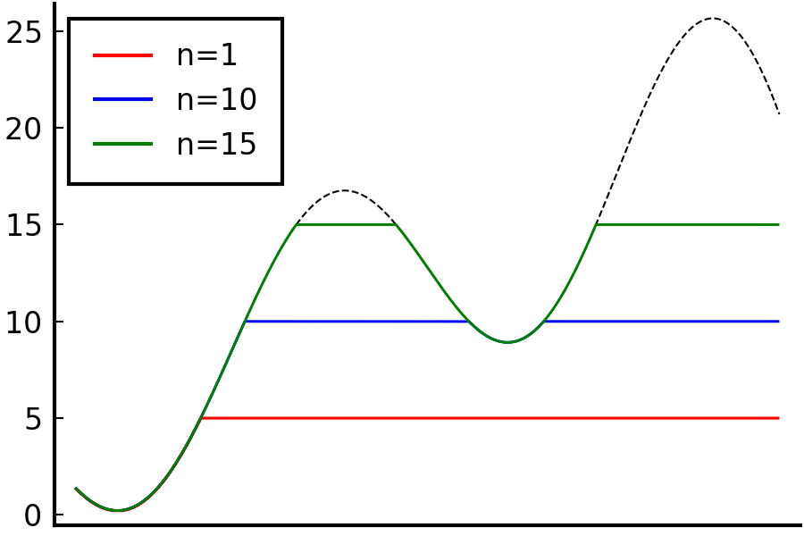

In this section, we define the expectation of a random variable as the Lebesgue integral with respect to the probability measure. First, I will introduce the *standard machine* in measure theory and use it to define the *Lebesgue integral*. Next, the definition of *expectation* will be discussed in terms of the Lebesgue integral.   

## The standard machine

The standard machine is a proof scheme in measure theory that is especially useful when proving properties of a general measurable function. The proof starts from the simplest form of functions, indicator functions, and repeatedly use the result from simpler functions to prove properties in more general functions. To be specific, the standard machine procedes in the following steps:

1. indicator function
2. simple function
3. non-negative measurable function
4. general measurable function

Some textbooks (including PTE) drops proof for indicator functions and intead add proof for bounded functions in between simple functions and non-negative functions. However in my experience starting with indicator function was much less cumbersome.

We define the Lebesgue integral using the standard machine, starting from the one for indicator functions.   

## The Lebesgue integral

Unlike the Riemann integration which was defined as the limit of sums of areas of rectangles that partitions the domain of a function (Riemann sum), the Lebesgue integral is defined as those that partitions the *image* of a measurable function. While the "height" of each rectangle was of interest in the Riemann integral, it is the "width" of it that is important when defining the Lebesgue integral. We use the measure of inverse image of a partition of a function's codomain as the width. (This is why we named such functions "measurable")

 
<em>(Blue) Riemann integral. (Red) Lebesgue integral. (<a href="https://en.wikipedia.org/wiki/Lebesgue_integration#/media/File:RandLintegrals.png">source</a>)</em>

 

The following definitions and statements are all assuming a measure space $(\Omega, \mathcal{F}, \mu)$ where $\mu$ is $\sigma$-finite unless otherwise noted.  

### 1. indicator function

 
$\mathbf{1}_A(x) := \begin{cases}
  1 &, \text{ if } x \in A \\
  0 &, \text{ otherwise}
\end{cases}$ 
where $A$ is measurable, is an indicator function.

An indicator function is trivially a measurable function since its inverse image is either $\phi$ or $\Omega$.

 
$\int_E \mathbf{1}_A d\mu := \mu(A\cap E),~ E \in \mathcal{B}(\mathbb{R})$ is the integral of $\mathbf{1}_A$ over $E$.

 

### 2. simple function

A simple function is a finite weighted sum of indicator functions.

 
$s(x) := \sum_{i=1}^n \alpha_i \mathbf{1}_{A_i}$, where $A_i$'s are measurable and $\alpha_i \in \mathbb{R},~ i=1,\cdots,n.$

Since the sum of measurable functions is also measurable, simple functions are measurable. Naturally, the Lebesgue integral of a simple function is defined in a similar way.

 
$\int_E s d\mu := \sum_{i=1}^n \alpha_i \mu(A_i \cap E),~ E \in \mathcal{B}(\mathbb{R}).$

 

### 3. non-negative measurable function
Things get a little interesting for non-negative measurable functions. For a non-negative funciton, its integral is defined as $\sup$ (or $\inf$) of simple functions.

 
Let $f: \Omega \to \mathbb{R}^+ \cup \{0\}$ be measurable. 
Let $\varphi$ be a simple function. 
$\int_E f d\mu := \sup\limits_{0 \le \varphi \le f} \int_E \varphi d\mu,~ E \in \mathcal{B}(\mathbb{R}).$

Consider a sequence of simple functions $\\{\varphi_n\\}_{n\in\mathbb{N}}$ that $\varphi_n(x) := (\lfloor 2^n f(x) \rfloor / 2^n) \wedge n$. Then $\varphi_n$ monotonically increases as $n$ increases and approaches $f$ from below. i.e. $\varphi_n \uparrow f$ as $n \uparrow \infty$. Thus such simple function in the definition exists and it is well-defined.  

 
<em>Shape of $\varphi_n$ with varying $n$. $f$: black dashed line.</em>

 

### 4. general measurable function
Now that we defined the integral of non-negative functions, the remaining part is easy. Let $f$ be a measurable function. Define its positive part $f^+ := f \vee 0$ and the negative part $f^- := -(f \wedge 0)$. Then $f = f^+ - f^-$ and $f^+,~ f^-$ are non-negative measurable functions. The integral of $f$ on a measurable set $E$ is defined as $\int_E f d\mu := \int_E f^+ d\mu - \int_E f^- d\mu$.

If $E=\Omega$, then we omit $\Omega$ for simplicity. That is, $\int f d\mu = \int_\Omega f d\mu$. We call $f$ is (Lebesgue) integrable if $\int \|f\| d\mu = \int f^+ d\mu + \int f^- d\mu < \infty$ and write $f \in L^1(\mu)$ or just $f \in L^1$ if the measure is clear.

There are several properties of the integral naturally arises from the definition.

Let $f,g$ be integrable, $A,B,E$ be measurable. 
(i) $f \le g \implies \int_E f d\mu \le \int_E g d\mu.$  
(ii) $A\subset B \implies \int_A f d\mu \le \int_B f d\mu.$  
(iii) $\int_E cf d\mu = c\int_E f d\mu,~ c \in \mathbb{R}.$  
(iv) $f = 0 \text{ on } E \implies \int_E f d\mu = 0.$  
(v) $\mu(E) = 0 \implies \int_E f d\mu = 0,~ \forall f.$  
(vi) $\int_E f d\mu = \int f \mathbf{1}_E d\mu.$

Since it is not difficult to show, I will leave it as an exercise. To prove somewhat straightforward-looking property $\int_E f+g d\mu = \int_E f d\mu + \int_E g d\mu$, we need help of [monotone convergence theorem](https://en.wikipedia.org/wiki/Monotone_convergence_theorem), which will be covered soon.  

## Expectation

I would like to finish this part by defining expectation of random variables. Recall that a random variable $X$ is a measurable function on a probability space $(\Omega, \mathcal{F}, P)$. The expectation is merely the integral of $X$ on $\Omega$ with respect to $P$. That is, $EX := \int X dP$.

As a side note, the Lebesgue integration can be viewed as a generalization of the Riemann integration. It can be shown that any Riemann integrable functions are Lebesgue integrable. Thus it is still viable to interpret expectation as a weight sum of probabilities for many random variables with Riemann integrable densities.

---

### Acknowledgement

This post series is based on the textbook *Probability: Theory and Examples*, 5th edition (Durrett, 2019) and the lecture at Seoul National University, Republic of Korea (instructor: Prof. Johan Lim).

This post is also based on the textbook *Real and Complex Analysis*, 3rd edition (Rudin, 1986) and the lecture at SNU (instructor: Prof. Insuk Seo).
