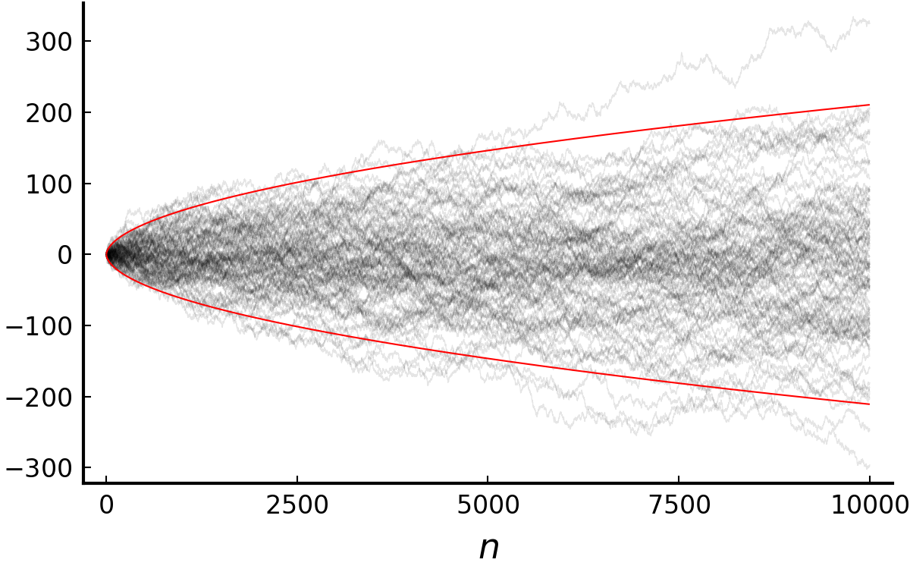

Putting together all of the topics we covered so far, we now move on to one of the most impactful theorem in probability theory: the strong law of large numbers (SLLN).

- TOC
{:toc}
 

## Strong law of large numbers

Let $X_1, X_2, \cdots$ be pairwise independent, identically distributed. $S_n = \sum_{i=1}^n X_i.$ 
$E|X_1| = \mu < \infty \implies \frac{S_n}{n} \to \mu \text{ a.s.}$

The strong law not only requires less conditions (pairwise rather than mutual independence) than the weak law but provides convergence in almost sure sense. We use the proof scheme similar to that of [(2.3.9)](https://naturale0.github.io/probability/PTE-2.3-B-C-lemmas#generalization-of-the-second-lemma). In addition, the [Cesàro's mean](https://en.wikipedia.org/wiki/Cesàro_summation) will be used: if $\lim_k Y_k = a$ then $\lim_n \frac{1}{n} \sum_{k=1}^n Y_k = a.$

Without loss of of generality, we only need to prove the case where $X_i \ge 0.$ Let $Y_k = X_k \mathbf{1}_{X_k \le k}$ and $T_n = \sum_{i=1}^n Y_i.$  

<i>(Step 1. <b>Claim</b>: $|\frac{T_n}{n} - \frac{ET_n}{n}| \to 0 \text{ a.s.} \implies \frac{S_n}{n} \to \mu \text{ a.s.}$)</i> 
(i) $\sum_{k=1}^\infty P(X_k > k) \le EX_1 < \infty.$ By the first Borel-Cantelli lemma, $P(X_k>k \text{ i.o.}) = P(X_k \ne Y_k \text{ i.o.}) = 0$ and $X_k \ne Y_k$ for at most finitely many $k$'s. Thus there exists $R$ such that $|T_n - S_n| \le R < \infty$ almost surely for all $n$ and $|\frac{T_n}{n}-\frac{S_n}{n}| \to 0 \text{ a.s.}$ as $n \to \infty.$ 
(ii) $\frac{ET_n}{n} = \frac{1}{n} \sum_{k=1}^n EY_k$ and $\lim_k EY_k = EX_1 = \mu$ by MCT. By the Cesàro mean, $\frac{ET_n}{n} \to \mu.$ 
Combine (i) and (ii) and the claim is proved.  

<i>(Step 2. $\exists k(n)$ s.t. $|\frac{T_{k(n)}}{k(n)} - \frac{ET_{k(n)}}{k(n)}| \to 0 \text{ a.s.}$)</i> 
$$
\begin{align}
&\;\;\;\;P\left(\vert\frac{T_{k(n)}}{k(n)} - \frac{ET_{k(n)}}{k(n)}\vert > \epsilon\right) \\
 &\le \frac{1}{\epsilon^2 k(n)^2} \text{Var}(T_{k(n)}) \\
 &= \frac{1}{\epsilon^2 k(n)^2} \sum\limits_{m=1}^{k(n)} \text{Var}(Y_m)
\end{align}
$$
We want the sum of probabilities
$$
\begin{align}
&\;\;\;\;\sum\limits_{n=1}^\infty P\left(\vert\frac{T_{k(n)}}{k(n)} - \frac{ET_{k(n)}}{k(n)}\vert > \epsilon\right) \\
 &\le \frac{1}{\epsilon^2} \sum\limits_{n=1}^\infty \frac{1}{k(n)^2} \sum\limits_{m=1}^{k(n)} \text{Var}(Y_m) \\
 &= \frac{1}{\epsilon^2} \sum\limits_{m=1}^\infty \text{Var}(Y_m) \sum\limits_{n:k(n)\ge m} \frac{1}{k(n)^2}
\end{align}
$$
to be finite. Let $k(n) = \lfloor \alpha^n \rfloor$ for $\alpha > 1$ then since $\lfloor \alpha^n \rfloor \ge \frac{1}{2} \alpha^n$,
$$
\begin{align}
&\;\;\;\;\sum\limits_{n:k(n)\ge m} \frac{1}{k(n)^2} \\
&=\sum\limits_{n:k(n)\ge m} \frac{1}{\lfloor \alpha^n \rfloor^2} \\
&\le 4 \sum\limits_{n:k(n)\ge m} \alpha^{-2n} \\
&\le \frac{4}{m^2 (1-\alpha^{-2})} \approx \frac{c}{m^2}.
\end{align}
$$
In order to show finiteness of the sum, we need to show $\sum_{k=1}^\infty \frac{1}{k^2} \text{Var}(Y_k) < \infty.$ This comes from
$$
\begin{align}
\text{Var}(Y_k) 
&\le EY_k^2 = \int_0^k 2y P(X_1 > y) dy. \\
\sum\limits_{k=1}^\infty \frac{1}{k^2} \text{Var}(Y_k)
&\le \sum\limits_{k=1}^\infty \frac{1}{k^2} \int_0^k 2y P(X_1 > y) dy \\
&= \int_0^\infty \left( \sum\limits_{k=1}^\infty \frac{1}{k^2} \mathbf{1}_{(y<k)} \right) 2y P(X_1 > y) dy \\
&\le 4EX_1 < \infty.
\end{align}
$$
The last inequality holds because 
$$
\begin{align}
\sum\limits_{k:k>y} \frac{1}{k^2} 2y &= 2y\sum\limits_{k:k\ge \lfloor y \rfloor + 1} \frac{1}{k^2} \\
&\le 2y \int_{\lfloor y \rfloor}^\infty \frac{1}{x^2} dx \\
&= \frac{2y}{\lfloor y \rfloor} \le 4.
\end{align}
$$
Hence $|\frac{T_{k(n)}}{k(n)} - \frac{ET_{k(n)}}{k(n)}| \to 0 \text{ a.s.}$  

<i>(Step 3. sandwich)</i> 
$T_{k(n)} \le T_m \le T_{k(n+1)}$ for $m:~ k(n) \le m \le k(n+1).$ Since $k(n) \to \infty$, every $m\in\mathbb{N}$ has a $k(n)$ and $k(n+1)$ that sandwiches $m.$ As $n \to \infty$, $\frac{k(n)}{k(n+1)} = \frac{\lfloor \alpha^n \rfloor}{\lfloor \alpha^{n+1} \rfloor} \to \frac{1}{\alpha}.$ Take $\liminf$ and $\limsup$ to each sides of
$$
\frac{T_{k(n)}}{k(n+1)} \le \frac{T_m}{m} \le \frac{T_{k(n+1)}}{k(n)}
$$ and we get
$$
\frac{1}{\alpha}\mu \le \liminf\limits_m\frac{T_m}{m}
 \le \limsup\limits_m\frac{T_m}{m}
 \le \alpha\mu \;\;\text{a.s.},~ \forall \alpha > 1.
$$
Since $\alpha$ was arbitrary, $\alpha \to 1$ then the proof is done.

 

## Application of the strong law
I would like to cover three important results that follow the strong law. The first example is about extending the theorem for the case where $EX_1 = \infty.$ The second will be about a simple form of renewal theory. The last will be the foundation of the theory of empirical processes: the Glivenko-Cantelli theorem. In addition to the results, I will mention the *law of iterated logarithm*, which is not named in the textbook, but quite useful to know for the following section of martingales.  

### 1. Extension of the strong law

$X_1,X_2,\cdots$ are i.i.d. with $EX_1^+ = \infty$, $EX_1^- < \infty.$ 
$\implies \frac{S_n}{n} \to \infty \text{ a.s.}$

This implies the strong law holds even if $EX_1$ is infinite.

 
It suffices to show that $\sum_{i=1}^n X_i^+/n \to \infty$ a.s. Let $Y_i^m = X_i^+ \mathbf{1}_{(X_i^+ \le m)}$ so that $Y_i^m$'s be i.i.d. and integrable. By SLLN, $\sum_{i=1}^n X_i^+ / n \ge \sum_{i=1}^n Y_i^m \to EY_1^m$ a.s. By MCT, $EY_1^m \uparrow EX_1^+ = \infty$ as $m \uparrow \infty.$

 

### 2. Renewal theory
The following theorem is about a simple version of [Renewal theory](https://en.wikipedia.org/wiki/Renewal_theory) arose from the question: How frequently should the light bulbs be exchanged to a new one? We are interested in the rate of the number of lightbulbs go out until the time $t$ versus $t$. Intuitively we can guess that it would be one over the mean lifetime of a bulb. The theorem confirms it.

$X_1,X_2,\cdots$ are i.i.d. with $0 < X_i < \infty$ and $EX_i = \mu \le \infty$ for all $i=1,2,\cdots.$ 
Let $T_n = X_1+\cdots+X_n$, $N_t = \sup\{n:~ T_n \le t\}.$ 
$\implies \frac{N_t}{t} \to \frac{1}{\mu} \text{ a.s.}$

Here, $X_i$ can be thought of as the lifetime of $i$th lightbulb and $N_t$ as the number of bulbs went out until the time $t$. We regard $1/\mu = \infty$ if $\mu = 0.$

 
$T_n/n \to \mu$ a.s. by SLLN. Observe that $T_{N_t} \le t \le T_{N_t+1}.$ As $t \to \infty$, $N_t \to \infty$ a.s. and $\frac{N_t+1}{N_t} \to 1$ a.s. Taking $\lim_{t\to\infty}$ on each terms of 
$$
\frac{T_{N_t}}{N_t+1} \le \frac{t}{N_t} \le \frac{T_{N_t+1}}{N_t}
$$
we get the result we want.

 

### 3. Glivenko-Cantelli theorem

Let $X_1,X_2,\cdots \overset{\text{iid}}{\sim} F.$ 
Let $F_n(x) = \frac{1}{n} \sum_{k=1}^n \mathbf{1}_{(X_k \le x)}.$ 
$\implies \sup_x |F_n(x) - F(x)| \to 0 \text{ a.s. as } n \to \infty$

The theorem states that as the number of independent observations grow, the empirical distribution approaches to the (unknown) population distribution almost surely.

 
<i>(1) pointwise convergence</i> 
&ensp; For a fixed $x\in\mathbb{R}$, $F_x(x) \to F(x)$ a.s. Let $Z_n = \mathbf{1}_{(X_n < x)}$ then $F_n(x^-)=\sum_{k=1}n Z_k \to F(x^-)$ a.s.
 
<i>(2) uniform convergence at grid points</i> 
&ensp; Let $x_{jk} = \inf\{y:~ F(y) \ge j/k\}$, $1\le j\le k-1$, $x_{0k} = -\infty$, $x_{kk} = \infty.$ By (1), for each $k$ there exists $N_k \in\mathbb{N}$ such that if $n\ge N_k$ then $|F_n(x_{jk}) - F(x_{jk})| < 1/k$ and $|F_n(x_{jk}^-) - F(x_{jk}^-)| < 1/k$ for all $1 \le j \le k-1.$
 
<i>(3) uniform convergence</i> 
&ensp; For all $x \in (x_{j-1,k}, x_{jk})$ and $n\ge N_k$,
$$
\begin{align}
F_n(x) &\le F_n(x_{jk}^-) \le F(x_{jk}^-) + \frac{1}{k} \\
&\le F(x_{j-1,k}) + \frac{2}{k} \le F(x) + \frac{2}{k}.
\end{align}
$$
Similarly, $F_n(x) \ge F(x) - \frac{2}{k}.$ Hence the desired result follows.

 

### 4. Law of iterated logarithm

I will finish this section by briefly stating [the law](https://en.wikipedia.org/wiki/Law_of_the_iterated_logarithm).

Let $X_1,X_2,\cdots$ be i.i.d. with $EX_1 = 0$ and $\text{Var}(X_1) = \sigma^2 < \infty.$ Let $S_n = X_1 + \cdots + X_n.$ Then 
$$
\limsup\limits_n \frac{S_n}{\sigma\sqrt{2n\log\log n}} = 1 \text{ a.s.} \\
\text{and } \liminf\limits_n \frac{S_n}{\sigma\sqrt{2n\log\log n}} = -1 \text{ a.s.}
$$

This gives us not only the asymptotic rate of $S_n$ but also the intuition that such random walk, regardless of its distribution, fluctuates between the values $\pm \sqrt{2n\log\log n}.$ As noted in Wikipedia, it bridges the gap between the law of large numbers (which is about $\frac{S_n}{n}$) and the central limit theorem ($\frac{S_n}{\sqrt{n}}$).  

 
<em>Black: 100 trials of $(S_n)$. Red: $\pm\sqrt{2n\log\log n}$.</em>

 

***Acknowledgement***

This post series is based on the textbook *Probability: Theory and Examples*, 5th edition (Durrett, 2019) and the lecture at Seoul National University, Republic of Korea (instructor: Prof. Johan Lim).

