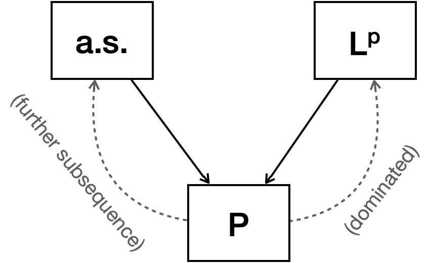

This is a quick review of convergence concepts and their relations.

- TOC
{:toc}
 

## Relationship between convergence concepts

$X_n \overset{L^p}{\to} X \implies X_n \overset{P}{\to} X.$

[I already mentioned the proof of it](http://naturale0.github.io/probability/PTE-2.2-Weak-laws-of-large-numbers): Use Markov-Chebyshev inequality.

Let $X_n, X \in L^p$ be random variables that $X_n \overset{P}{\to} X.$ If there exists $Y\in L^p$ such that $|X_n - X| \le Y$ for all $n$, then $X_n \overset{L^p}{\to} X.$

The result directly follows from the dominated convergence theorem.

For $1\le q < p$, $X_n \overset{L^p}{\to} X \implies X_n \overset{L^q}{\to} X.$

This is from the Jensen's inequality. Hölder's inequality can also yield the result.   

 
<em>Relationship between convergence concepts.</em>

 

## Counterexamples

 
Let $(\Omega, \mathcal{F}, P) = ((0,1], \mathcal{B}((0,1]), \lambda)$ where $\lambda$ is the Lebesgue measure. 
Let $X_{n,m}(\omega) = \begin{cases}
1 &,~ \frac{m-1}{2^n} < \omega \le \frac{m}{2^n} \\
0 &,~ \text{otherwise}
\end{cases}$ 
Let $\{Y_n:~ n\in\mathbb{N}\} = \{X_{1,1}, X_{1,2}, X_{2,1}, X_{2,2}, \cdots\}.$ Then $Y_n \overset{P}{\to} 0$ and $Y_n \overset{L^p}{\to} 0$, but $Y_n \not\to 0 \text{ a.s.}$

 
Let $(\Omega, \mathcal{F}, P) = ((0,1], \mathcal{B}((0,1]), \lambda)$ where $\lambda$ is the Lebesgue measure.
 
$X_n(\omega) := \begin{cases}
2^n &,~ 0 < \omega \le \frac{1}{2^n}\\
0 &,~ \text{otherwise}
\end{cases}
$ 
Then $X_n \overset{P}{\to} 0$ but not in $L^p.$ In fact, it does not converge to a constant at all if $p > 1.$

  

***Acknowledgement***

This post series is based on the textbook *Probability: Theory and Examples*, 5th edition (Durrett, 2019) and the lecture at Seoul National University, Republic of Korea (instructor: Prof. Johan Lim).